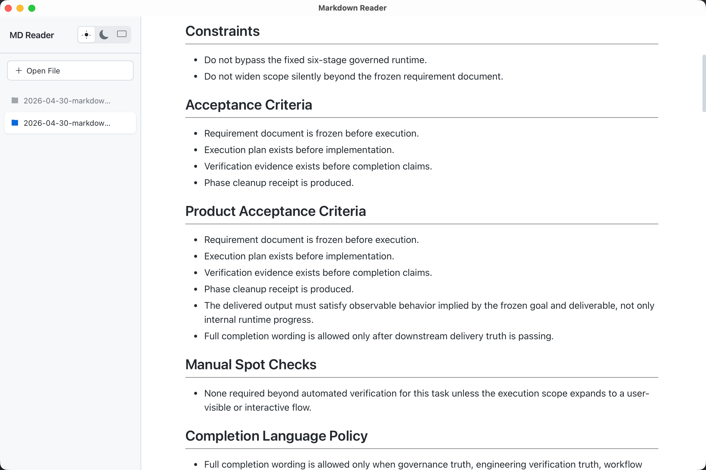
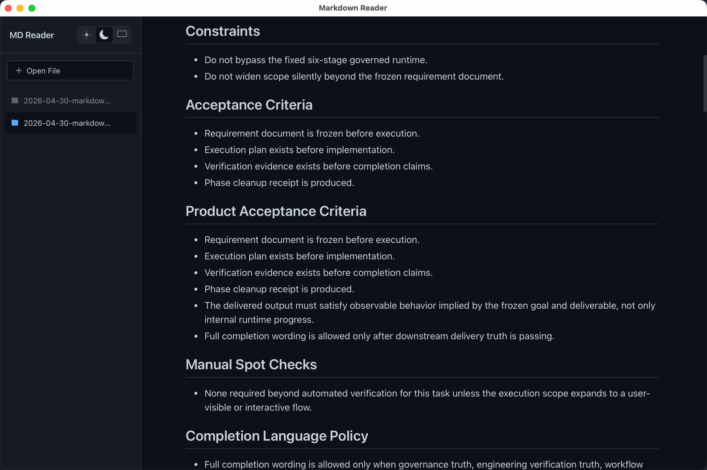

<p align="center">
  
</p>

<h1 align="center">MD Reader</h1>

<p align="center">
  一个轻量、美观的桌面 Markdown 阅读器，支持 GitHub 风格渲染。
  <br>
  <a href="README.md">English</a>
</p>

<p align="center">
  
  &nbsp;&nbsp;
  
</p>

## 功能特性

- **GitHub 风格渲染** — 与 GitHub README 页面完全一致的展示效果，支持 GFM 表格、任务列表和代码块
- **亮色 / 暗色 / 跟随系统** — 三种主题模式，一键切换；跟随系统模式自动响应操作系统主题变化
- **拖拽打开** — 将 `.md` 文件直接拖入窗口即可打开
- **多标签侧边栏** — 可同时打开多个文件，在左侧边栏中切换
- **极致轻量** — 二进制文件仅约 3.3 MB，基于 Rust 和 Tauri 构建
- **跨平台** — 支持 macOS（ARM64、Intel）、Windows（x64）、Linux（x64）

## 安装

从 [Releases](https://github.com/yunxuanhao/markdown_reader/releases) 页面下载最新版本。

| 平台 | 安装包 |
|------|--------|
| macOS | `.dmg`（ARM64 / Intel） |
| Windows | `.msi` / `.exe` |
| Linux | `.deb` / `.AppImage` |

> **macOS 用户：** 由于应用未经过公证，打开时可能会提示"已损坏"。请右键点击应用选择 **打开**，或执行：
> ```bash
> xattr -d com.apple.quarantine "Markdown Reader.app"
> ```

## 开发

### 环境要求

- [Node.js](https://nodejs.org/) 22+
- [pnpm](https://pnpm.io/) 10+
- [Rust](https://www.rust-lang.org/) 1.88+

### 快速开始

```bash
# 安装依赖
pnpm install

# 启动开发服务器（热重载）
pnpm tauri dev

# 构建当前平台安装包
pnpm build:native
```

### 构建命令

```bash
pnpm build:mac          # macOS ARM64
pnpm build:mac-intel    # macOS Intel
pnpm build:win          # Windows x64
pnpm build:linux        # Linux x64
pnpm build:native       # 自动检测当前平台
pnpm build:all          # 所有平台（需要交叉编译环境）
```

### 技术栈

| 层级 | 技术 |
|------|------|
| 桌面框架 | [Tauri v2](https://v2.tauri.app/) |
| 前端 | [React 18](https://react.dev/) + [TypeScript](https://www.typescriptlang.org/) |
| 构建工具 | [Vite](https://vitejs.dev/) |
| Markdown 渲染 | [react-markdown](https://github.com/remarkjs/react-markdown) + [remark-gfm](https://github.com/remarkjs/remark-gfm) |
| 样式 | [github-markdown-css](https://github.com/sindresorhus/github-markdown-css) |

## 许可证

MIT
